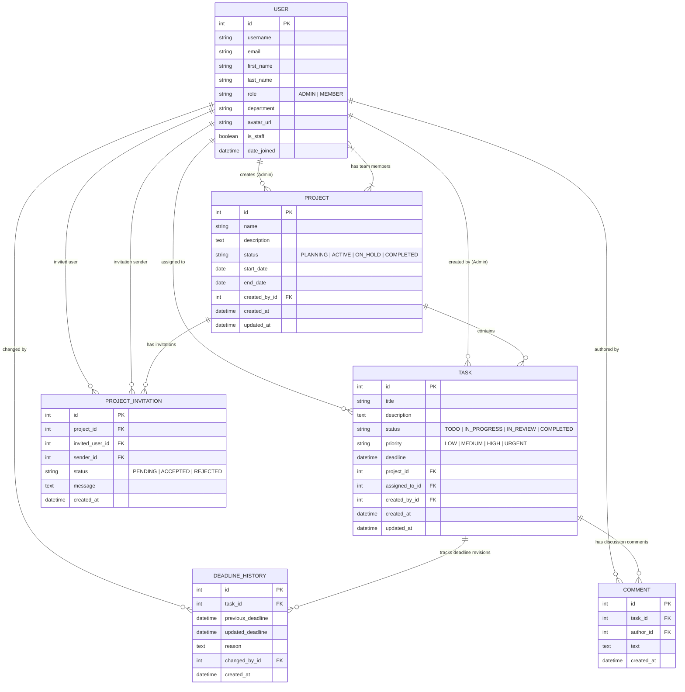

# 🗄️ Database Schema & Entity-Relationship (ER) Diagram

This document details the relational database design, data models, primary/foreign key relationships, fields, data types, and integrity constraints for the **TeamSync** Team Project & Task Management Application.

---

## 📐 Entity-Relationship (ER) Diagram

---

## 📊 Relational Database Table Specifications

### 1. `users_user` (Custom User Model)
Extends Django `AbstractUser` to support system roles, departments, and custom profile attributes.

| Field Name | Data Type | Constraints | Description |
| :--- | :--- | :--- | :--- |
| `id` | `INTEGER` | `PRIMARY KEY`, `AUTO_INCREMENT` | Unique user identifier |
| `username` | `VARCHAR(150)` | `UNIQUE`, `NOT NULL` | System login handle |
| `email` | `VARCHAR(254)` | `UNIQUE`, `NOT NULL` | User email address |
| `first_name` | `VARCHAR(150)` | `NULLABLE` | User first name |
| `last_name` | `VARCHAR(150)` | `NULLABLE` | User last name |
| `role` | `VARCHAR(20)` | `DEFAULT 'MEMBER'`, Choices: `ADMIN`, `MEMBER` | Role-Based Access Control role |
| `department` | `VARCHAR(100)` | `NULLABLE` | User organizational department |
| `avatar_url` | `VARCHAR(500)` | `NULLABLE` | Optional profile avatar URL |
| `is_staff` | `BOOLEAN` | `DEFAULT FALSE` | Django admin access flag (Synced with `role='ADMIN'`) |
| `date_joined` | `DATETIME` | `NOT NULL` | Account registration timestamp |

---

### 2. `projects_project` (Projects Table)
Stores project details, timelines, status, and creator ownership.

| Field Name | Data Type | Constraints | Description |
| :--- | :--- | :--- | :--- |
| `id` | `INTEGER` | `PRIMARY KEY`, `AUTO_INCREMENT` | Unique project identifier |
| `name` | `VARCHAR(255)` | `NOT NULL` | Project title |
| `description` | `TEXT` | `BLANK` | Detailed project scope and goals |
| `status` | `VARCHAR(20)` | `DEFAULT 'ACTIVE'`, Choices: `PLANNING`, `ACTIVE`, `ON_HOLD`, `COMPLETED` | Project lifecycle status |
| `start_date` | `DATE` | `NULLABLE` | Project start date |
| `end_date` | `DATE` | `NULLABLE` | Project target completion date |
| `created_by_id` | `INTEGER` | `FOREIGN KEY (users_user.id)`, `SET_NULL` | Admin user who created the project |
| `created_at` | `DATETIME` | `AUTO_NOW_ADD` | Project creation timestamp |
| `updated_at` | `DATETIME` | `AUTO_NOW` | Last modification timestamp |

---

### 3. `projects_project_members` (Project Team Members Many-to-Many)
Junction table mapping users to assigned projects.

| Field Name | Data Type | Constraints | Description |
| :--- | :--- | :--- | :--- |
| `id` | `INTEGER` | `PRIMARY KEY`, `AUTO_INCREMENT` | Junction record ID |
| `project_id` | `INTEGER` | `FOREIGN KEY (projects_project.id)`, `CASCADE` | Linked project ID |
| `user_id` | `INTEGER` | `FOREIGN KEY (users_user.id)`, `CASCADE` | Linked team member user ID |

---

### 4. `projects_projectinvitation` (Project Join Requests Table)
Tracks join requests sent by Admins to Team Members.

| Field Name | Data Type | Constraints | Description |
| :--- | :--- | :--- | :--- |
| `id` | `INTEGER` | `PRIMARY KEY`, `AUTO_INCREMENT` | Unique invitation request ID |
| `project_id` | `INTEGER` | `FOREIGN KEY (projects_project.id)`, `CASCADE` | Project requested to join |
| `invited_user_id` | `INTEGER` | `FOREIGN KEY (users_user.id)`, `CASCADE` | Team Member invited |
| `sender_id` | `INTEGER` | `FOREIGN KEY (users_user.id)`, `CASCADE` | Admin who sent the request |
| `status` | `VARCHAR(20)` | `DEFAULT 'PENDING'`, Choices: `PENDING`, `ACCEPTED`, `REJECTED` | Request response status |
| `message` | `TEXT` | `BLANK` | Custom message from Admin |
| `created_at` | `DATETIME` | `AUTO_NOW_ADD` | Invitation sent timestamp |

---

### 5. `tasks_task` (Tasks Table)
Stores task specifications, assignees, deadlines, and completion statuses.

| Field Name | Data Type | Constraints | Description |
| :--- | :--- | :--- | :--- |
| `id` | `INTEGER` | `PRIMARY KEY`, `AUTO_INCREMENT` | Unique task identifier |
| `title` | `VARCHAR(255)` | `NOT NULL` | Task title |
| `description` | `TEXT` | `BLANK` | Task requirements and work instructions |
| `status` | `VARCHAR(20)` | `DEFAULT 'TODO'`, Choices: `TODO`, `IN_PROGRESS`, `IN_REVIEW`, `COMPLETED` | Workflow status |
| `priority` | `VARCHAR(20)` | `DEFAULT 'MEDIUM'`, Choices: `LOW`, `MEDIUM`, `HIGH`, `URGENT` | Priority level |
| `deadline` | `DATETIME` | `NOT NULL` | Current target deadline |
| `project_id` | `INTEGER` | `FOREIGN KEY (projects_project.id)`, `CASCADE` | Parent project |
| `assigned_to_id` | `INTEGER` | `FOREIGN KEY (users_user.id)`, `SET_NULL` | Assigned team member |
| `created_by_id` | `INTEGER` | `FOREIGN KEY (users_user.id)`, `SET_NULL` | Admin creator |
| `created_at` | `DATETIME` | `AUTO_NOW_ADD` | Creation timestamp |
| `updated_at` | `DATETIME` | `AUTO_NOW` | Last update timestamp |

---

### 6. `tasks_deadlinehistory` (Deadline Revision Audit Log Table)
Additional Challenge requirement storing chronological historical deadline revisions.

| Field Name | Data Type | Constraints | Description |
| :--- | :--- | :--- | :--- |
| `id` | `INTEGER` | `PRIMARY KEY`, `AUTO_INCREMENT` | Unique audit log entry ID |
| `task_id` | `INTEGER` | `FOREIGN KEY (tasks_task.id)`, `CASCADE` | Target task ID |
| `previous_deadline` | `DATETIME` | `NOT NULL` | Previous deadline timestamp |
| `updated_deadline` | `DATETIME` | `NOT NULL` | New updated deadline timestamp |
| `reason` | `TEXT` | `BLANK` | Mandatory editor justification reason |
| `changed_by_id` | `INTEGER` | `FOREIGN KEY (users_user.id)`, `SET_NULL` | User who updated deadline |
| `created_at` | `DATETIME` | `AUTO_NOW_ADD` | Revision record timestamp |

---

### 7. `tasks_comment` (Task Comments Table)
Stores user progress notes, questions, and discussion messages on tasks.

| Field Name | Data Type | Constraints | Description |
| :--- | :--- | :--- | :--- |
| `id` | `INTEGER` | `PRIMARY KEY`, `AUTO_INCREMENT` | Unique comment ID |
| `task_id` | `INTEGER` | `FOREIGN KEY (tasks_task.id)`, `CASCADE` | Parent task ID |
| `author_id` | `INTEGER` | `FOREIGN KEY (users_user.id)`, `CASCADE` | Comment author ID |
| `text` | `TEXT` | `NOT NULL` | Comment body text |
| `created_at` | `DATETIME` | `AUTO_NOW_ADD` | Posting timestamp |
