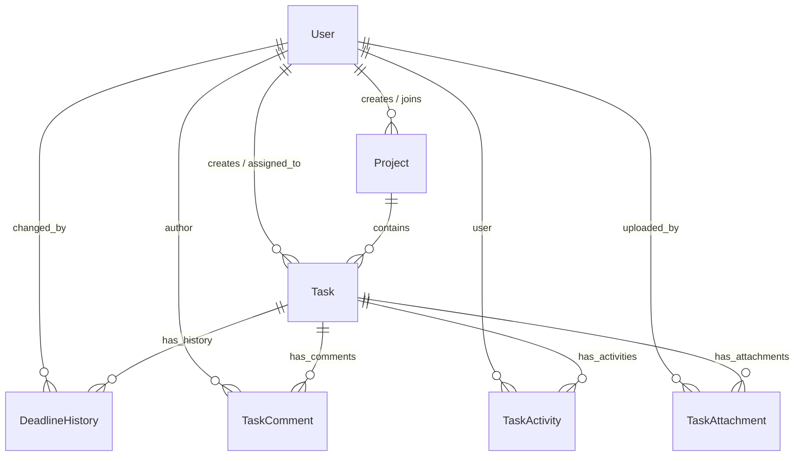

# Product Requirement Document (PRD) - TeamSync 🚀

**Product Name**: TeamSync - Enterprise Project & Task Management Suite  
**Version**: 1.2.0  
**Repository**: [`https://github.com/RajkumarPadmanabhan/TeamSync.git`](https://github.com/RajkumarPadmanabhan/TeamSync.git)  
**Target Architecture**: Full-Stack Decoupled Architecture (Next.js 15 App Router + Django REST Framework 5)

---

## 1. Executive Summary & Product Goals

**TeamSync** is an enterprise-grade Team Project & Task Management application designed for multi-role corporate environments. Built with inspiration from MNC enterprise consoles (Google Cloud, AWS, and Wipro), TeamSync enables organizations to manage projects, assign tasks, track completion progress, enforce role-based access control (**Admin** vs **Team Member**), and maintain an immutable historical audit trail of task deadline revisions.

---

## 2. Technology Stack & System Architecture

### 2.1 Technology Stack Matrix
| Component | Technology | Version / Specification |
| :--- | :--- | :--- |
| **Frontend Framework** | Next.js (React 19, App Router) | 16.3.1 |
| **Styling & Design System** | Vanilla CSS / Tailwind CSS v4 | Dark Slate Palette (`#0f172a`, `#1e293b`) |
| **Icon System** | Lucide React | 1.33.0 |
| **Backend Framework** | Django REST Framework (DRF) | Python 3.13 / Django 5 |
| **Database** | SQLite / Relational ORM | `db.sqlite3` with Django ORM |
| **Authentication** | SimpleJWT (JSON Web Token) | Bearer Token Auth (`/api/auth/`) |
| **Containerization** | Docker & Docker Compose | Multi-stage Dockerfiles |

---

## 3. User Personas & Role-Based Access Control (RBAC)

### 3.1 Role 1: Admin (`ADMIN`)
- **Target User**: Project Managers, Engineering Leads, Department Heads.
- **Key Permissions & Capabilities**:
  - **Create & Manage Projects**: Initialize projects, set status (`PLANNING`, `ACTIVE`, `ON_HOLD`, `COMPLETED`), start/end dates, and assign member access.
  - **Team Onboarding**: Register & onboard new team members with specific roles (`ADMIN` or `MEMBER`) and departments.
  - **Task Allocation**: Create tasks, assign tasks to team members, configure priority levels (`LOW`, `MEDIUM`, `HIGH`, `URGENT ⚡`), and set due dates.
  - **Deadline Revision Auditing**: Modify task deadlines with mandatory **Audit Reason** entry (logs entry in `DeadlineHistory`).
  - **Executive Analytics**: Access executive KPI cards (Total Projects, Active Tasks, Completion Rate %, Deadline Changes Logged) and multi-segment progress bars.

### 3.2 Role 2: Team Member (`MEMBER`)
- **Target User**: Software Engineers, UI/UX Designers, QA Analysts.
- **Key Permissions & Capabilities**:
  - **Assigned Tasks View**: View tasks filtered specifically by assigned user ("My Tasks Only").
  - **Status Workflow Updates**: 1-Click status transitions (`TODO` ➔ `IN_PROGRESS` ➔ `IN_REVIEW` ➔ `COMPLETED`).
  - **Technical Progress Updates**: Post technical comments and progress updates on assigned tasks.
  - **Read-Only Deadline & Priority Context**: View priority tags, deadline countdowns, and historical audit logs.

---

## 4. Functional Specifications

### 4.1 Backend Architecture Requirements
- **Custom User Model**: Extends `AbstractUser` with `role` (`ADMIN` vs `MEMBER`), `department`, and `avatar_url`.
- **Project Progress Calculation**: `ProjectSerializer` dynamically computes `total_tasks`, `completed_tasks`, and `progress_percentage`.
- **Deadline Change Interception**: Intercepts `perform_update` in DRF `TaskViewSet` to log `DeadlineHistory` entries whenever `deadline` changes.
- **Activity Stream Logging**: Logs `TaskActivity` entries for task creation, status updates, deadline changes, comments, and file attachments.
- **Console Email Dispatch**: Sends automated email notifications to assignees on task creation or deadline modification.

### 4.2 Frontend Architecture Requirements
- **MNC Slate Interface**: Top navbar with user account badge, global search bar, executive KPI stat tiles, Kanban/List task views, and modal drawers.
- **Dedicated AuthScreen (`/login`)**: Login and Sign Up forms featuring a **Role Dropdown Selector** (`Admin 👑` vs `Team Member 👤`).
- **Interactive Modals**:
  - `ProjectModal`: Project creation wizard.
  - `TaskModal`: Task wizard with deadline revision reason prompt.
  - `DeadlineModal`: Audit trail timeline modal visualizing old vs new deadlines.
  - `TaskDetailModal`: Task status switcher, comment feed, activity log, and file attachments.
  - `TeamRosterModal`: Team onboarding wizard.

---

## 5. Database Schema & Data Models

---

## 6. REST API Endpoints Catalog Summary

Full specifications located in [`apiguide.md`](file:///c:/Users/Rajkumar/Downloads/TeamSync/apiguide.md).

| Category | Method | Endpoint URL | Description | Access |
| :--- | :--- | :--- | :--- | :--- |
| **Auth** | `POST` | `/api/auth/login/` | Obtain JWT Bearer access token & user profile | Public |
| **Auth** | `POST` | `/api/auth/register/` | Register new user with Role Dropdown choice | Public |
| **Auth** | `GET` | `/api/auth/me/` | Fetch current authenticated user profile | Authenticated |
| **Auth** | `GET` | `/api/auth/users/` | List all team directory users | Authenticated |
| **Projects** | `GET` | `/api/projects/` | List all projects with progress percentage | Authenticated |
| **Projects** | `POST` | `/api/projects/` | Create new project | Admin Only |
| **Projects** | `POST` | `/api/projects/{id}/add_member/` | Add member to project | Admin Only |
| **Tasks** | `GET` | `/api/tasks/` | List tasks with filters (`project`, `assigned_to_me`, `status`, `priority`) | Authenticated |
| **Tasks** | `POST` | `/api/tasks/` | Create task and assign to team member | Admin Only |
| **Tasks** | `PATCH` | `/api/tasks/{id}/` | Update status (Member) or deadline/priority (Admin) | Role-based |
| **Tasks** | `GET` | `/api/tasks/{id}/deadline_history/` | Fetch deadline revision history logs | Authenticated |
| **Tasks** | `GET` | `/api/tasks/{id}/activity_history/` | Fetch task activity stream | Authenticated |
| **Tasks** | `GET/POST` | `/api/tasks/{id}/comments/` | Fetch & post technical comments | Authenticated |
| **Tasks** | `GET/POST` | `/api/tasks/{id}/attachments/` | Fetch & upload multipart file attachments | Authenticated |
| **Analytics**| `GET` | `/api/tasks/dashboard_stats/` | Fetch executive dashboard KPI metrics | Authenticated |

---

## 7. Additional Challenge & Optional Enhancements

| Requirement / Enhancement | Specifications | Status |
| :--- | :--- | :--- |
| **Additional Challenge** | Mandatory **Deadline Revision Audit Log** recording `previous_deadline`, `new_deadline`, `changed_by`, `changed_at`, and `reason` in `DeadlineHistory`. | ✅ Completed |
| **Email Notifications** | Automated email dispatch on task assignment & deadline revisions via Django Console Email Backend. | ✅ Completed |
| **Task Activity History** | Activity feed capturing creation, status updates, deadline changes, comments, and file attachments. | ✅ Completed |
| **Search & Multi-Filters** | Global search bar + multi-select filters by status, priority, assignee, and project. | ✅ Completed |
| **File Attachments** | Multipart upload & preview links via `/api/tasks/{id}/attachments/`. | ✅ Completed |
| **Docker Orchestration** | `backend/Dockerfile`, `frontend/Dockerfile`, and root `docker-compose.yml`. | ✅ Completed |
| **Automated Test Suite** | Django test suite (`apps.tasks.tests`) & E2E role script (`verify_roles.py`). | ✅ Completed |
