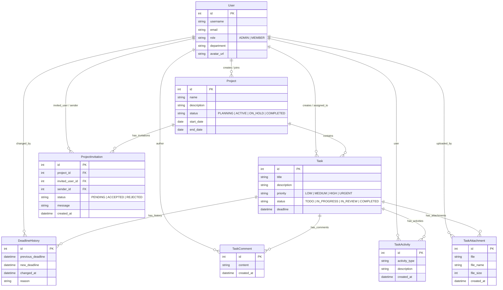

# TeamSync - Enterprise Project & Task Management Suite 🚀


**TeamSync** is an enterprise-grade Team Project & Task Management web application built with **Next.js 15 (App Router)** for the frontend and **Django REST Framework** for the backend API. Designed with inspiration from MNC enterprise management consoles (Google Cloud, AWS, and Wipro), TeamSync provides role-based workspaces for **Admins** and **Team Members**, project completion metrics, status workflows, and complete audit tracking.

---

## 📌 Deliverables Summary

- **GitHub Repository**: [`https://github.com/RajkumarPadmanabhan/TeamSync.git`](https://github.com/RajkumarPadmanabhan/TeamSync.git)
- **Live Local Deployment**:
  - **Frontend Application**: `http://localhost:3000`
  - **Backend REST API**: `http://localhost:8000/api`
- **API Documentation**: [`apiguide.md`](file:///c:/Users/Rajkumar/Downloads/TeamSync/apiguide.md) & [`apiguide`](file:///c:/Users/Rajkumar/Downloads/TeamSync/apiguide)
- **Full Walkthrough Report**: [`walkthrough.md`](file:///C:/Users/Rajkumar/.gemini/antigravity-ide/brain/3b761292-d5ed-42bd-bca1-838d10409cb6/walkthrough.md)

---

## ✨ Features & Role Capabilities

### 👑 Admin Capabilities
- **Project Management**: Create projects (`Enterprise Cloud Migration`, `Mobile Banking Portal 2.0`, `AI Workflow Automation`), set start/end dates, and manage project member access.
- **Team Onboarding**: Invite & create team members (`Alice Vance`, `Bob Miller`, `Charlie Zhang`) with role permissions (`ADMIN` vs `MEMBER`) and departments.
- **Task Assignment & Scheduling**: Create tasks, assign tasks to team members, set priorities (`Low`, `Medium`, `High`, `Urgent ⚡`), and configure deadlines.
- **Deadline Change Auditing**: Modify task deadlines with mandatory **Audit Reason** notes.
- **Executive Analytics**: Monitor executive KPI cards (Total Projects, Active Tasks, Completion Rate %, Deadline Changes Logged) and multi-segment progress bars.

### 👤 Team Member Capabilities
- **Assigned Tasks View**: View tasks filtered by project or logged-in user ("My Tasks Only").
- **Status Workflow Switcher**: Quick 1-click status transitions (`To Do` ➔ `In Progress` ➔ `In Review` ➔ `Completed`).
- **Comments & Progress Updates**: Post real-time comments and technical progress updates on assigned tasks.
- **Deadline & Priority Badges**: View deadline countdowns, priority badges, and project specifications.
- **1-Click Role Switcher**: Quick role switching pill in top navbar for instant preview & testing between Admin and Team Member personas.

---

## 🌟 Additional Challenge: Task Deadline Change Audit Log

Whenever a task deadline is adjusted by an Admin, the backend Django REST Framework automatically intercepts the update and creates an audit record in `DeadlineHistory`:
- `previous_deadline`
- `new_deadline`
- `changed_by` (Admin profile & avatar)
- `changed_at` (Timestamp)
- `reason` (Justification note)

An interactive **Deadline Audit Trail Timeline Modal** displays visual diffs of all historical deadline revisions.

---

## ⚡ Optional Enhancements Implemented

| Enhancement | Description |
| :--- | :--- |
| **Email Notifications** | Django Console Email Backend automatically dispatches emails when task deadlines are revised or tasks are assigned/reassigned to team members. |
| **Task Activity History** | `TaskActivity` model & `/api/tasks/{id}/activity_history/` endpoint capturing chronological log of task creation, status updates, deadline revisions, reassignments, comments, and file uploads. |
| **Search & Multi-Filters** | Global search bar + multi-select filters by status (`To Do`, `In Progress`, `In Review`, `Completed`), priority (`Low`, `Medium`, `High`, `Urgent`), assignee ("My Tasks Only"), and project. |
| **File Attachments** | `TaskAttachment` model & `/api/tasks/{id}/attachments/` endpoint supporting multipart file uploads, formatted file sizes, and download/preview links. |
| **Docker Container Setup** | `backend/Dockerfile`, `frontend/Dockerfile`, and root `docker-compose.yml` for single-command container deployment. |
| **Automated Test Suite** | Django unit test suite (`apps.tasks.tests`) & API verification script (`test_api.py`) verifying endpoints and deadline tracking. |

---

## 📊 Database Schema & ER Diagram



---

## 🔑 Pre-configured Demo Accounts (1-Click Role Switcher)

| Account Name | Username / Email | Role | Department | Default Password |
| :--- | :--- | :--- | :--- | :--- |
| **Rajkumar Padmanabhan** | `admin` / `admin@teamsync.com` | `ADMIN` | Engineering Leadership | `password123` |
| **Alice Vance** | `alice` / `alice@teamsync.com` | `MEMBER` | Frontend Engineering | `password123` |
| **Bob Miller** | `bob` / `bob@teamsync.com` | `MEMBER` | Backend Engineering | `password123` |
| **Charlie Zhang** | `charlie` / `charlie@teamsync.com` | `MEMBER` | UI/UX Design | `password123` |

---

## 🛠️ Installation & Setup Instructions

### Prerequisites
- Python 3.11+
- Node.js 20+ / npm 10+
- Docker & Docker Compose (Optional for container deployment)

---

### Method 1: Local Development Setup

#### 1. Clone Repository & Setup Virtual Environment
```bash
git clone https://github.com/RajkumarPadmanabhan/TeamSync.git
cd TeamSync

# Create Python virtual environment
python -m venv venv

# Activate Virtual Environment
# Windows PowerShell:
.\venv\Scripts\Activate.ps1
# Linux/macOS:
source venv/bin/activate
```

#### 2. Backend Setup (Django REST API)
```bash
cd backend

# Install Python requirements
pip install django djangorestframework django-cors-headers djangorestframework-simplejwt

# Run Database Migrations
python manage.py makemigrations users projects tasks common
python manage.py migrate

# Seed Initial Demo Data (Admin, Team Members, Projects, Tasks, Deadline Logs)
python manage.py seed_data

# Run Django Backend Server
python manage.py runserver 8000
```
- Backend REST API will be live at `http://localhost:8000/api`

#### 3. Frontend Setup (Next.js App Router)
```bash
# In a new terminal window
cd frontend

# Install Node dependencies
npm install

# Start Next.js Development Server
npm run dev
```
- Open `http://localhost:3000` in your web browser.

---

### Method 2: Docker Container Setup (1-Command Startup)

Run both backend and frontend in Docker containers with a single command:

```bash
docker-compose up --build
```

- Next.js Web Application: `http://localhost:3000`
- Django REST API Backend: `http://localhost:8000/api`

---

## 🧪 Running Automated Unit Tests

```bash
cd backend
python manage.py test
```

Run automated end-to-end REST API verification script:
```bash
cd backend
python test_api.py
```

---

## 📖 API Documentation Summary (`apiguide.md`)

Full specifications are located in [`apiguide.md`](file:///c:/Users/Rajkumar/Downloads/TeamSync/apiguide.md).

### Main Endpoints Catalog:
- `POST /api/auth/login/` - Authenticate user & receive JWT Bearer token + role payload
- `POST /api/auth/register/` - Register new user
- `GET /api/auth/me/` - Current authenticated user details
- `GET /api/projects/` - List projects with progress metrics
- `POST /api/projects/` - Create project (*Admin Only*)
- `GET /api/tasks/` - List tasks (*Supported query filters: `project`, `status`, `priority`, `assigned_to_me`*)
- `POST /api/tasks/` - Create task (*Admin Only*)
- `PATCH /api/tasks/{id}/` - Update task (*Team Member: status; Admin: full update + deadline tracking*)
- `GET /api/tasks/{id}/deadline_history/` - Task deadline audit log timeline
- `GET /api/tasks/{id}/activity_history/` - Task activity audit history log
- `GET / POST /api/tasks/{id}/comments/` - List & post task comments / progress updates
- `GET / POST /api/tasks/{id}/attachments/` - List & upload task file attachments
- `GET /api/tasks/dashboard_stats/` - Executive dashboard KPI metrics summary
