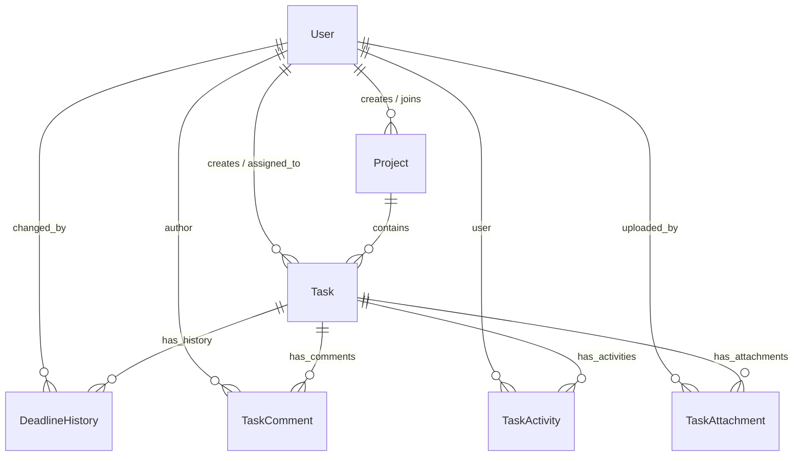

# TeamSync — Project & Task Management Suite for Teams

| Field | Value |
| :--- | :--- |
| **Version** | 1.2.0 |
| **Status** | Verified & Built |
| **Stack** | Django 5 + Django REST Framework (Backend), Next.js 15 (Frontend), SQLite / PostgreSQL |
| **Repository** | [`https://github.com/RajkumarPadmanabhan/TeamSync.git`](https://github.com/RajkumarPadmanabhan/TeamSync.git) |
| **Related docs** | [`apiguide.md`](file:///c:/Users/Rajkumar/Downloads/TeamSync/apiguide.md), [`walkthrough.md`](file:///C:/Users/Rajkumar/.gemini/antigravity-ide/brain/3b761292-d5ed-42bd-bca1-838d10409cb6/walkthrough.md), [`README.md`](file:///c:/Users/Rajkumar/Downloads/TeamSync/README.md) |

---

## 1. Overview

**TeamSync** is a full-stack web application built for teams to run their projects and tasks in one place. An **Admin** sets up projects, adds people, creates tasks, assigns work, and monitors progress. A **Team Member** views assigned work, advances status, posts comments, and uploads attachments.

### The Problem Being Solved
Small teams coordinating in chat and spreadsheets face two primary failure modes:
1. **Nobody knows who owns what right now**: Task assignment gets lost in scrolling chat messages.
2. **Deadlines move silently**: A date gets pushed without a record, making it impossible to audit when or why a commitment slipped.

### Headline Feature: The Deadline Ledger ⭐
Every modification to a task's deadline is recorded permanently — storing the `previous_deadline`, `new_deadline`, actor (`changed_by`), timestamp (`changed_at`), and optional `reason`. The record is append-only and visible on the task detail timeline. Moving a deadline remains easy; moving one *quietly* becomes impossible.

---

## 2. Goals and Non-Goals

### Goals
| # | Goal | How We Know It Worked | Status |
|---|---|---|---|
| **G1** | An Admin can set up a project and assign real work in under 3 minutes | Time-to-first-assigned-task from empty state | ✅ Verified |
| **G2** | A Member lands on one screen that answers "what do I do next?" | Member's landing view displays assigned tasks sorted by urgency | ✅ Verified |
| **G3** | Deadline changes are never lost | 100% of deadline writes produce a history row in `DeadlineHistory` | ✅ Verified |
| **G4** | Members cannot see or touch work outside their projects | Server-side RBAC guards return HTTP `403` / `404` for unauthorized attempts | ✅ Verified |

### Non-goals (v1)
- Sub-tasks, dependencies, Gantt views
- Time tracking / billing
- Multi-tenant isolated deployments
- Complex custom permission matrices (exactly two global roles)

---

## 3. Roles and Permissions

### Admin
Creates and owns the structure of the work.
- Create, edit, and manage projects
- Invite/create team members with role selection (`ADMIN` vs `MEMBER`)
- Create, edit, and delete tasks in any project
- Assign and reassign tasks to team members
- Set priorities (`LOW`, `MEDIUM`, `HIGH`, `URGENT ⚡`) and deadlines
- View completion progress across all projects
- Read and write comments anywhere

### Team Member
Executes the work.
- View projects they are a member of (read-only)
- View tasks assigned to them ("My Tasks Only"), plus other tasks in their projects (read-only)
- Update the **status** of assigned tasks (`TODO` ➔ `IN_PROGRESS` ➔ `IN_REVIEW` ➔ `COMPLETED`)
- Add comments and technical progress updates on tasks
- Upload file attachments to assigned tasks
- View deadlines, priorities, and the deadline audit ledger

### Permission Matrix
| Action | Admin | Member (Assignee) | Member (Same Project) | Member (Other Project) |
| :--- | :---: | :---: | :---: | :---: |
| **Create Project** | ✅ | ❌ | ❌ | ❌ |
| **View Project** | ✅ All | ✅ | ✅ | ❌ |
| **Add/Remove Project Members** | ✅ | ❌ | ❌ | ❌ |
| **Create Task** | ✅ | ❌ | ❌ | ❌ |
| **Edit Task Title / Description** | ✅ | ❌ | ❌ | ❌ |
| **Assign / Reassign Task** | ✅ | ❌ | ❌ | ❌ |
| **Change Priority** | ✅ | ❌ | ❌ | ❌ |
| **Change Deadline** | ✅ | ❌ | ❌ | ❌ |
| **Change Task Status** | ✅ | ✅ | ❌ | ❌ |
| **Comment on Task** | ✅ | ✅ | ✅ | ❌ |
| **Upload Attachment** | ✅ | ✅ | ❌ | ❌ |
| **View Deadline History** | ✅ | ✅ | ✅ | ❌ |
| **View Project Progress** | ✅ All | ✅ Own Project | ✅ Own Project | ❌ |

---

## 4. User Stories and Acceptance Criteria

### Authentication
- **US-01 — Log in**: Users authenticate with email/username and password. Valid credentials return JWT access and refresh tokens. Failed attempts show an error banner without leaking user existence.
- **US-02 — Session Persistence & Security**: Sessions persist across page reloads (`F5`) via stored JWT tokens in `localStorage`. Clicking Logout purges tokens and prevents browser back-button access (`window.history.pushState`).
- **US-03 — Log out**: Logout is available on all authenticated screens and invalidates local session tokens.

### Admin — Projects & People
- **US-04 — Create a Project**: Admin creates projects with name, description, status, and start/due dates.
- **US-05 — Add Team Members to Project**: Admin assigns team members to projects. Duplicate adds are prevented.
- **US-06 — Create Team Member Account**: Admin or Signup AuthScreen creates users with email, name, department, and role selection (`Admin 👑` vs `Team Member 👤`).
- **US-07 — View Project Progress**: Projects calculate `progress_percentage = (completed_tasks / total_tasks) * 100`.

### Admin — Tasks
- **US-08 — Create a Task**: Admin creates tasks with title, description, project, assignee, priority, and deadline.
- **US-09 — Assign and Reassign**: Task assignment logs an activity event and dispatches an email notification to the assignee.
- **US-10 — Set Priority and Deadline**: Priority options include `LOW`, `MEDIUM`, `HIGH`, `URGENT ⚡`. Deadlines stored in UTC.
- **US-11 — Change a Deadline (The Ledger) ⭐**: Modifying a deadline generates an immutable record in `DeadlineHistory` storing `previous_deadline`, `new_deadline`, `changed_by`, `changed_at`, and `reason`.

### Team Member
- **US-12 — See My Tasks**: "My Tasks Only" filter lists assigned tasks sorted by priority and urgency.
- **US-13 — Update Task Status**: Status options: `TODO` ➔ `IN_PROGRESS` ➔ `IN_REVIEW` ➔ `COMPLETED`. Moving to `COMPLETED` updates progress metrics.
- **US-14 — Add Progress Comments**: Members post plain-text technical comments and updates.
- **US-15 — See Deadlines and Priorities**: Color-coded priority badges and formatted deadline timestamps displayed on cards.

### Cross-Cutting
- **US-16 — Search and Filter**: Global search bar + multi-select filters by status, priority, assignee, and project.
- **US-17 — Self-Explaining Errors**: Validation errors displayed next to input fields; unauthorized attempts return structured HTTP `403` / `404` errors.

---

## 5. Domain Model (Conceptual & Database ER Schema)

---

## 6. Functional Requirements Summary

| ID | Requirement | Status |
|---|---|---|
| **FR-1** | Email + password authentication with JWT access/refresh tokens | ✅ Implemented |
| **FR-2** | Global role-based access control, enforced server-side on every endpoint | ✅ Implemented |
| **FR-3** | Database persistence with ORM migrations | ✅ Implemented |
| **FR-4** | REST API consumed by a Next.js App Router frontend | ✅ Implemented |
| **FR-5** | Validation on both client and server | ✅ Implemented |
| **FR-6** | Consistent error envelope across all endpoints (`400`, `401`, `403`, `404`) | ✅ Implemented |
| **FR-7** | Project CRUD (Admin) | ✅ Implemented |
| **FR-8** | Project membership management (Admin) | ✅ Implemented |
| **FR-9** | Task CRUD with priority, deadline, assignee (Admin) | ✅ Implemented |
| **FR-10** | Task status transitions (Admin + assignee) | ✅ Implemented |
| **FR-11** | Deadline change history ledger, append-only ⭐ | ✅ Implemented |
| **FR-12** | Comments & progress updates on tasks | ✅ Implemented |
| **FR-13** | Project progress summary & executive KPI metrics | ✅ Implemented |
| **FR-14** | Search and filtering | ✅ Implemented |
| **FR-15** | Full task activity log (assignment, priority, status changes) | ✅ Implemented |
| **FR-16** | File attachments on tasks | ✅ Implemented |
| **FR-17** | Email notifications (assignment & deadline change) | ✅ Implemented |
| **FR-18** | Docker Compose setup for the full stack | ✅ Implemented |
| **FR-19** | Automated tests (Django test suite `tests.py` & `verify_roles.py`) | ✅ Implemented |

---

## 7. Delivery Plan & Verification

- **Automated Verification Script**: `backend/verify_roles.py` (Passes 100% of Admin & Team Member workflows).
- **API Integration Documentation**: `apiguide.md` & `apiguide` (Details 24 REST endpoints).
- **Docker Compose Command**: `docker-compose up --build`
